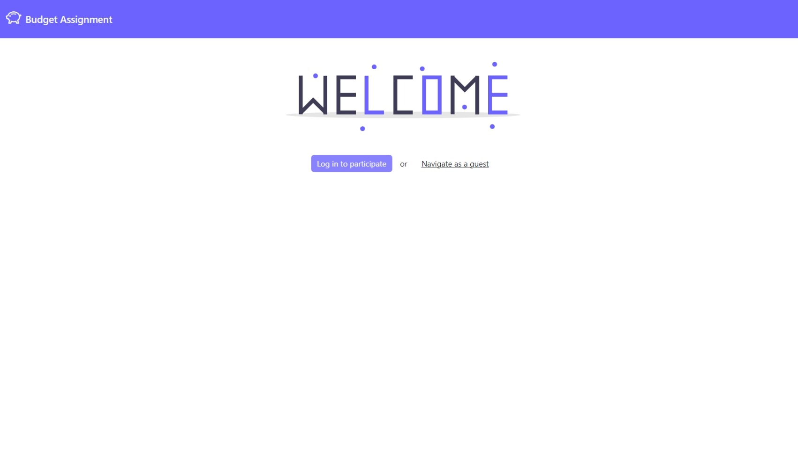
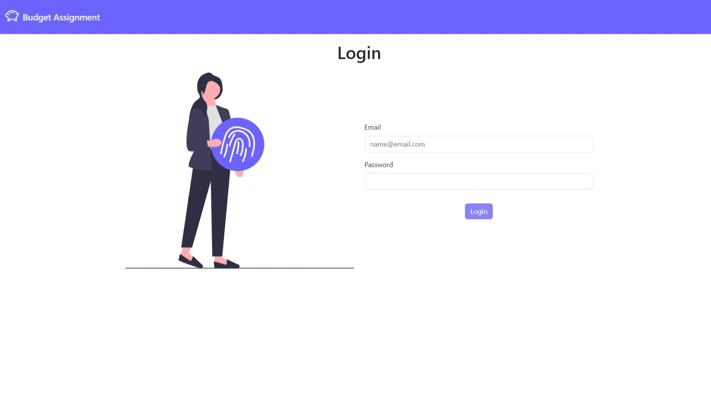
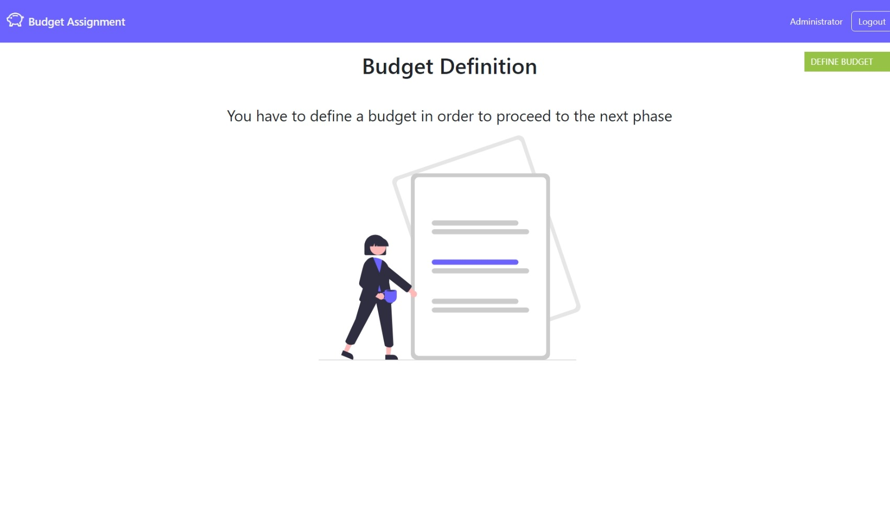
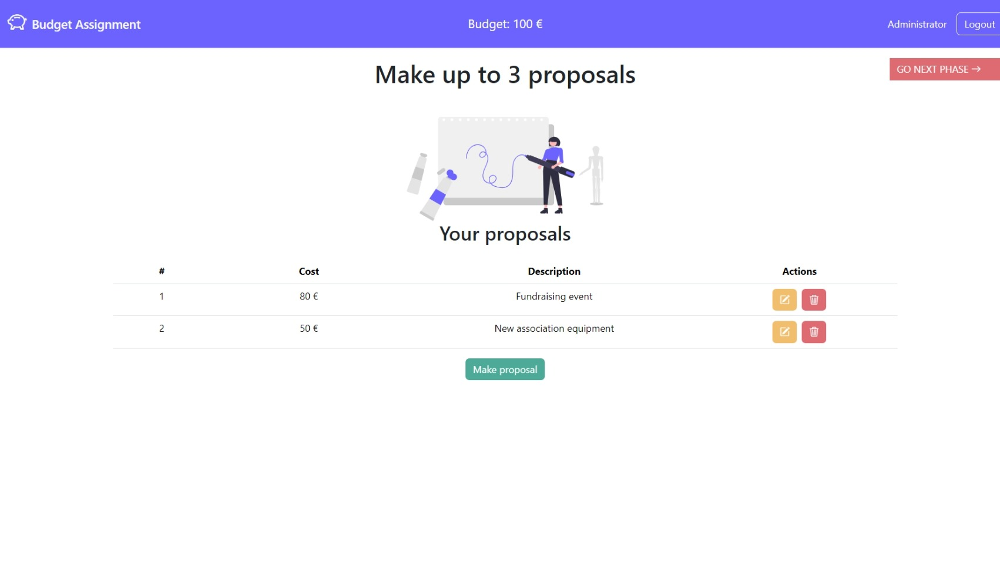
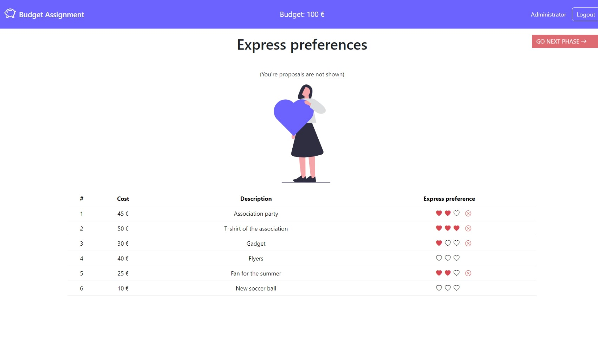
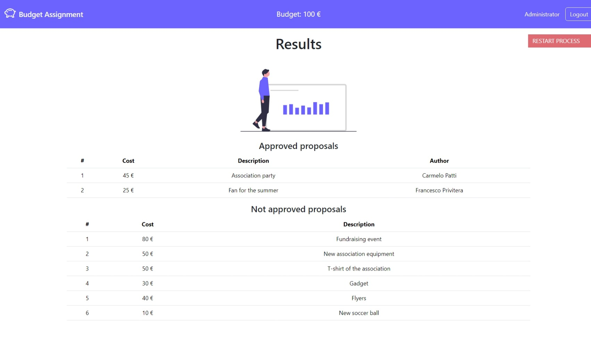

# Exam #2: "Social Budget"

## Student: s331552 PULVIRENTI MICHELE

## React Client Application Routes

- Route `/`: Welcome page
- Route `/login`: Page used to perform login
- Route `/process`: Main page of the website, it changes its content based on the process' phase
- Route `/budget`: Page used to define the budget (admin only)
- Route `/proposal`: Page used to make a proposal

## Main React Components

- `WelcomeLayout` (in `WelcomeLayout.jsx`): component that welcomes everyone enters the website
- `LoginLayout` (in `LoginLayout.jsx`): component used to perform login to the website
- `MemberProcessLayout` (in `MemberProcessLayout.jsx`): main component for a member, it changes its content based on process' phase
- `AdminProcessLayout` (in `AdminProcessLayout.jsx`): main component for the admin, it changes its content based on process' phase
- `AnonymousLayout` (in `AnonymousLayout.jsx`): main component for an anonymous user, it shows the approved proposals if available
- `BudgetLayout` (in `BudgetLayout.jsx`): component used to define a budget (admin only)
- `MakeProposalLayout` (in `MakeProposalLayout.jsx`): component used to make a proposal

- `Header` (in `Header.jsx`): component that renders the navbar of the website
- `Proposals` (in `Proposals.jsx`): component that shows the users's proposals and let you modify them
- `Preferences` (in `Preferences.jsx`): component that shows the users's preferences and let you modify them
- `Results` (in `Results.jsx`): component that shows approved proposals (for anyone) and not approved proposals (for logged in users) at the end of the process

## API Server

### Session routes

- POST `/api/sessions`: Perform login

  - Request body: username, password
  - Returns User
  - Status codes: 200, 401
  - Errors: Invalid credentials

- GET `/api/sessions/current`: Get current logged user

  - Returns User
  - Status codes: 200, 401
  - Errors: Not authenticated

- DELETE `/api/sessions/current`: Perform logout

  - Status codes: 200

### Process routes

- GET `/api/process`: Get current process

  - Returns Process
  - Status codes: 200, 400

- GET `/api/process/phase`: Get current process's phase

  - Returns {phase:number}
  - Status codes: 200, 400

- POST `/api/process/budget`: Define process budget and go to phase 1

  - Request body: {budget: number}
  - Returns {ok:boolean}
  - Status codes: 200, 400, 404, 422
  - Errors: NotValidEurError, NoProcessError, PhaseZeroOnlyError

- POST `/api/process/next`: Go to next phase

  - Request body: {}
  - Returns {ok:boolean}
  - Status codes: 200, 400, 404
  - Errors: NoProcessError, NoBudgetError, FinishedError,

- POST `/api/process/restart`: Restart the entire process from phase 0

  - Request body: {}
  - Returns {ok:boolean}
  - Status codes: 200, 400
  - Errors: PhaseThreeOnlyError

### Proposal routes

- GET `/api/proposal`: Get current user proposals

  - Returns Proposal[]
  - Status codes: 200

- GET `/api/proposal/all`: Get all proposals except users' ones

  - Returns Proposal[]
  - Status codes: 200, 400, 404
  - Errors: PhaseTwoOnlyError, NoProcessError

- GET `/api/proposal/approved`: Get approved proposals

  - Returns ApprovedProposal[]
  - Status codes: 200, 400, 404
  - Errors: PhaseThreeOnlyError, NoProcessError

- GET `/api/proposal/not-approved`: Get not approved proposals

  - Returns Proposal[]
  - Status codes: 200, 400, 404
  - Errors: PhaseThreeOnlyError, NoProcessError

- POST `/api/proposal/`: Add new proposal

  - Request body: {description:string, cost:number, processId:number}
  - Returns {ok:boolean}
  - Status codes: 200, 400, 404
  - Errors: NotValidEurError, NoProcessError, PhaseOneOnlyError, MaxProposalsReachedError, NoBudgetError, CostOverBudgetError

- PUT `/api/proposal/:id`: Modify existent proposal

  - Request params: id of proposal
  - Request body: {description:string, cost:number}
  - Returns {ok:boolean}
  - Status codes: 200, 400, 404, 422
  - Errors: NotValidEurError, ProposalNotFoundError, NoProcessError, PhaseOneOnlyError, NotYourProposalError, NoBudgetError, CostOverBudgetError

- DELETE `/api/proposal/:id`: Delete existent proposal

  - Request params: id of proposal
  - Returns {ok:boolean}
  - Status codes: 200, 400, 404, 422
  - Errors: ProposalNotFoundError, NoProcessError, PhaseOneOnlyError, NotYourProposalError

### Preference routes

- GET `/api/preference`: Get current user preferences

  - Returns Preference[]
  - Status codes: 200

- POST `/api/preference/`: Add new preference

  - Request body: {proposalId:string, score:number}
  - Returns {ok:boolean}
  - Status codes: 200, 400, 404, 422
  - Errors: NoProcessError, PhaseTwoOnlyError, ProposalNotFoundError, ItsOwnError, OnlyOneError

- DELETE `/api/preference/:proposalId`: Delete existent preference

  - Request params: id of proposal
  - Returns {ok:boolean}
  - Status codes: 200, 400, 404, 422
  - Errors: ProposalNotFoundError, NoProcessError, PhaseTwoOnlyError, ItsOwnError (proposal), PreferenceNotFoundError, NotItsOwnError (preference)

## Database Tables

- Table `users`
  - id: id of the user
  - username: username of the user
  - name: name of the user
  - role: role of the user (ADMIN or MEMBER)
  - password: password of the user hashed
  - salt: salt used to hash the password
  - createdAt: date of creation
  - updatedAt: date of last update
- Table `processes`
  - id: id of the process
  - phase: current phase (0,1,2,3)
  - budget: budget of the process
  - createdAt: date of creation
  - updatedAt: date of last update
- Table `proposals`
  - id: id of the proposal
  - userId: id of the user that created the proposal
  - processId: id of the process it refers to
  - description: description of the proposal
  - cost: cost of the proposal
  - preferences: sum of all preferences for the proposal
  - approved: the proposal is approved or not
  - createdAt: date of creation
  - updatedAt: date of last update
- Table `preferences`
  - userId: id of the user that expressed the preference
  - proposalId: id of the proposal it refers to
  - score: value of the preference
  - createdAt: date of creation
  - updatedAt: date of last update

## Screenshots

<!--  -->

<!--  -->

<!--  -->

<!--  -->

## Users Credentials

- username: admin@email.com, password: socialbudget24, role: ADMIN
- username: carmelo@email.com, password: socialbudget24, role: MEMBER
- username: rosario@email.com, password: socialbudget24, role: MEMBER
- username: francesco@email.com, password: socialbudget24, role: MEMBER
